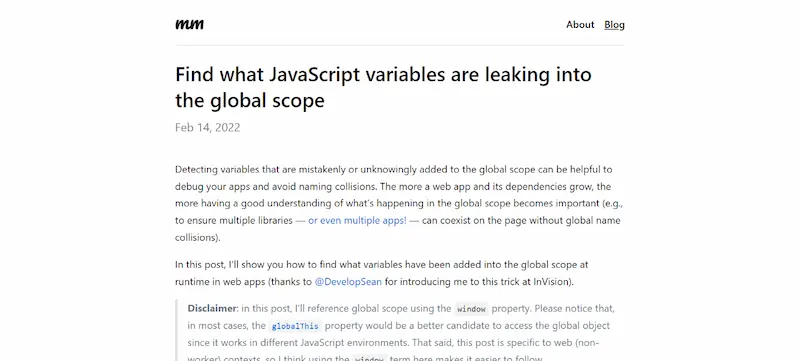

# 找出泄漏的全局变量

本文给出了一种方法，可以用脚本自动列出所有泄露到全局的 JavaScript 变量。

## 相关资料

- [找出泄漏的 JavaScript 全局变量（英文）](https://mmazzarolo.com/blog/2022-02-14-find-what-javascript-variables-are-leaking-into-the-global-scope/)
