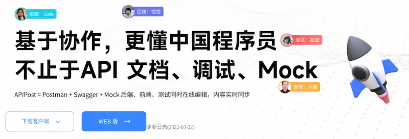
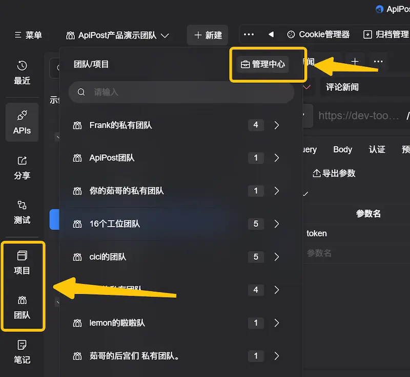
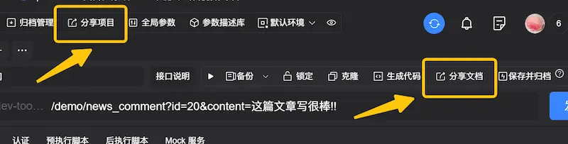
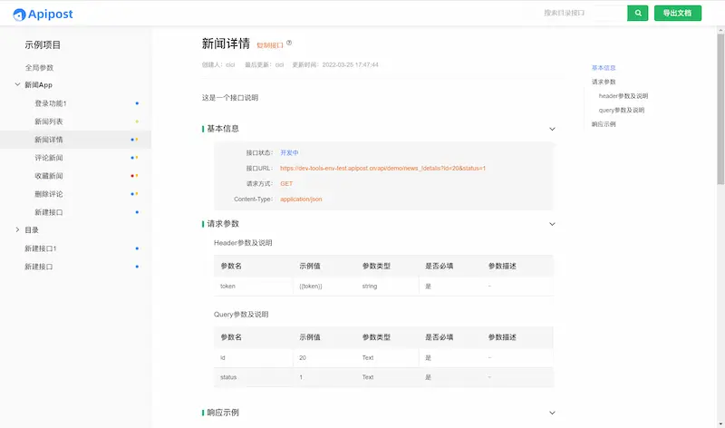

# 研发协同工具 Apipost

> 原文：<https://www.ruanyifeng.com/blog/2022/04/weekly-issue-203.html>

今天的主角就是一款国产的研发协同工具 [Apipost](https://www.apipost.cn/?utm_source=10031)。

互联网软件现在主要采用 REST 模式（后端提供数据接口，前端消费接口），优点是前后端分离，可以各自独立开发，缺点是项目越大，前后端协同越困难。

Apipost 的定位就是，`基于协作的 API 研发协同工具`，为开发者提供不止于 API 文档、调试、Mock 等大量功能。你可以把它看成 Postman + Swagger + Mock 的集成体。

它在 Postman 的基础上，加强团队协作和项目管理。团队的所有角色，都可以使用这个工具进行协同。

- 后端程序员：上线接口以后，来这里构造 URL 进行调试；也可以先提供接口参数，让 Apipost 生成 Mock 数据，供前端提前调用接口。
- 前端程序员：根据后端给出的接口、文档和 Mock 数据进行开发；还可以使用代码生成功能，自动生成常用语言的接口请求代码。
- 测试人员：使用 Apipost 的接口自动测试。
- 产品经理：查看接口开发进度，掌握项目进展。

## 6.0版提特色功能

**（1）`一键快速生成文档`**。 接口文档的撰写非常麻烦，很多属于重复工作，效率低下。接口参数填写完毕后，只要在 Apipost 按下"分享文档"按钮（下图），就会一键自动生成漂亮、规范的文档，并且可以自定义分享有效期及权限。

**（2）`团队成员间可实时协作`**。 针对团队成员间协作不同步，数据保存有冲突，无法追溯变更记录的情况，多人在线协作时，Apipost 支持数据实时同步，有冲突解决机制，并且可以追溯协作日志。

**（3）`客户端支持不登录使用`**。 用户处于局域网环境时（或者公司对网络限制严格），Apipost 客户端支持不登录使用。

**（4）`客户端支持离线脱机使用`**。 即使在拔掉网线的情况下，仍可以正常打开 Apipost 客户端的进行大部分操作。

**（5）`参数库描述`**。 很多接口往往具有大量相同名称、相同意义的参数，每次手动重复录入，非常耗时、低效。Apipost 通过自定义参数描述库，可以将大量参数进行预注释，并在输入参数时支持自动填充描述，节省了我们不少重复录入参数描述的时间。

Apipost 现提供跨平台的[客户端](https://www.apipost.cn/download.html)和 [Web 版](https://console.apipost.cn/register)。**`所有功能都免费使用`**，新建项目和接口不限数量。只有商业项目的团队超过 **`15`** 人，或者需要私有部署时，才会收费。
